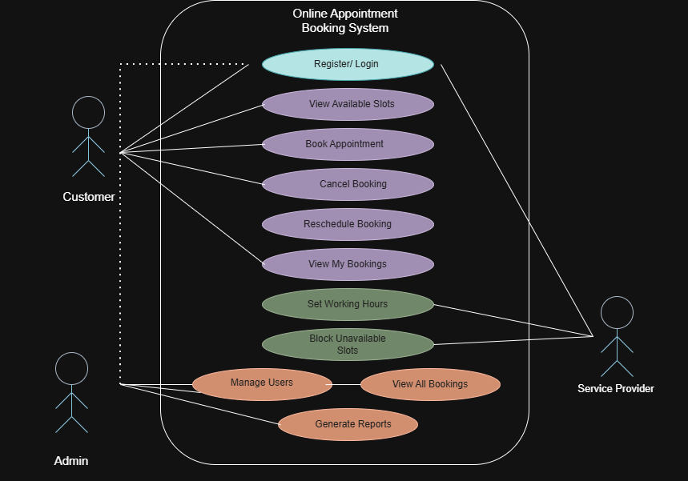
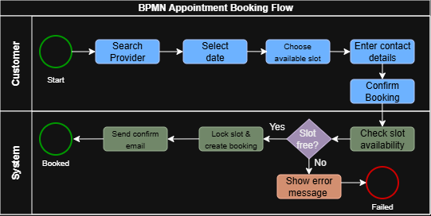
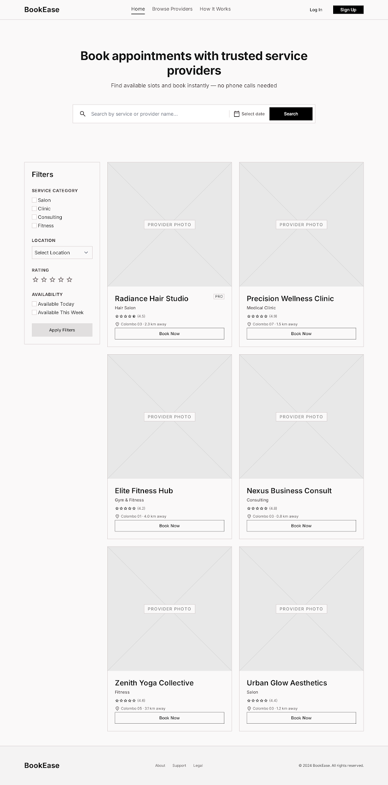
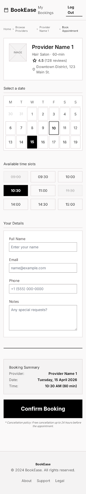
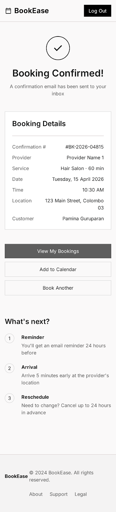

# Online Appointment Booking System
## Business Analysis Case Study

**Prepared by:** Pamina Guruparan  
**Date:** 2026  
**Tools used:** draw.io, Figma, Google Docs

---

## 📋 Table of Contents

1. [Project Overview](#1-project-overview)
2. [Stakeholders](#2-stakeholders)
3. [Problem Statement](#3-problem-statement)
4. [Functional Requirements](#4-functional-requirements)
5. [Non-Functional Requirements](#5-non-functional-requirements)
6. [User Stories with Acceptance Criteria](#6-user-stories-with-acceptance-criteria)
7. [Assumptions](#7-assumptions)
8. [UML Use Case Diagram](#8-uml-use-case-diagram)
9. [BPMN Process Flow](#9-bpmn-process-flow)
10. [Wireframes](#10-wireframes)

---

## 1. Project Overview

The Online Appointment Booking System is a web-based platform that allows customers to view real-time availability and book appointments with service providers (e.g., salons, clinics, consultants) without phone calls or back-and-forth messaging. The system aims to reduce manual scheduling effort for providers while giving customers a self-service booking experience available 24/7.

---

## 2. Stakeholders

| Stakeholder | Role | Interest in the System |
|---|---|---|
| **Customer** | End user booking appointments | Wants a quick, easy way to find and book available time slots without phone calls. |
| **Service Provider** | Professional offering services | Wants to manage availability, avoid double-bookings, and reduce no-shows. |
| **Admin** | System administrator | Wants to manage user accounts, monitor bookings, and maintain system reliability. |

---

## 3. Problem Statement

Service providers currently rely on phone calls, social media DMs, and manual diaries to manage appointments, which leads to double-bookings, missed messages, and lost revenue from no-shows. Customers often have to call during business hours to check availability, which is inconvenient and creates friction in the booking experience. There is a clear need for a centralized, self-service platform where customers can independently view availability and book confirmed appointments while providers retain full control over their schedules.

---

## 4. Functional Requirements

The system shall:

- Allow customers to register and log in using email and password authentication.
- Allow customers to view available time slots for a selected service provider and date.
- Allow customers to book, reschedule, or cancel an appointment up to 24 hours in advance.
- Send automated email confirmations and reminders to customers upon booking, rescheduling, or cancellation.
- Allow service providers to set their working hours, block off unavailable slots, and define service durations.
- Prevent double-booking by locking a time slot once a booking is confirmed.
- Allow customers to view their upcoming and past bookings in a personal dashboard.
- Allow admins to manage user accounts, view all bookings, and generate basic usage reports.

---

## 5. Non-Functional Requirements

- **Performance:** The system shall load any page within 2 seconds under normal load and support up to 500 concurrent users.
- **Security:** All user passwords shall be hashed, and all data transmission shall be encrypted via HTTPS.
- **Usability:** The booking flow shall be completable in 4 steps or fewer, and the UI shall be responsive across mobile, tablet, and desktop devices.
- **Availability:** The system shall maintain 99% uptime, excluding scheduled maintenance windows communicated 48 hours in advance.

---

## 6. User Stories with Acceptance Criteria

### User Story 1
*As a Customer, I want to view available time slots for a service provider so that I can choose a time that fits my schedule.*

**Acceptance Criteria:**
- **Given** I am a logged-in customer on a service provider's profile page,
- **When** I select a date from the calendar,
- **Then** the system displays all available (unbooked) time slots for that date within the provider's working hours.

---

### User Story 2
*As a Customer, I want to book an appointment in a chosen time slot so that I can secure my preferred time without calling the provider.*

**Acceptance Criteria:**
- **Given** I have selected an available time slot,
- **When** I confirm the booking by entering my contact details and clicking 'Confirm Booking',
- **Then** the system creates the booking, locks the slot, and sends me a confirmation email within 1 minute.

---

### User Story 3
*As a Customer, I want to cancel a booking so that the provider can free up the slot for someone else.*

**Acceptance Criteria:**
- **Given** I have an upcoming booking more than 24 hours away,
- **When** I click 'Cancel Booking' from my dashboard and confirm,
- **Then** the system cancels the booking, releases the slot, and sends me a cancellation confirmation email.

---

### User Story 4
*As a Service Provider, I want to set my working hours and block unavailable slots so that customers only see slots I am actually available for.*

**Acceptance Criteria:**
- **Given** I am logged in as a service provider on my dashboard,
- **When** I update my weekly working hours or block specific time ranges,
- **Then** the system updates my availability immediately and no customer can book within blocked or non-working hours.

---

### User Story 5
*As an Admin, I want to view all bookings in the system so that I can monitor usage and identify any issues.*

**Acceptance Criteria:**
- **Given** I am logged in as an admin,
- **When** I navigate to the 'All Bookings' dashboard,
- **Then** the system displays a paginated, filterable list of all bookings with customer name, provider, date, time, and status.

---

## 7. Assumptions

- All service providers offer fixed-duration services (e.g., 30 or 60 minutes); variable-duration services are out of scope for v1.
- Payments are handled offline between customer and provider; in-app payment processing is out of scope for v1.
- Customers and service providers have access to a stable internet connection and a modern web browser (Chrome, Safari, Firefox, Edge).

---

## 8. UML Use Case Diagram

The use case diagram below illustrates the interactions between the three actors (Customer, Service Provider, Admin) and the system's core functionality.

**Key insights:**
- **Customer** interacts with booking-related use cases (register, view slots, book, cancel, reschedule, view bookings).
- **Service Provider** manages availability (set working hours, block slots) and views their bookings.
- **Admin** oversees system operations (manage users, view all bookings, generate reports).
- "Register / Log In" is shared across all actors as a common authentication entry point.

---

## 9. BPMN Process Flow

The BPMN diagram below maps the end-to-end appointment booking journey, separated into Customer and System swimlanes. It includes an exclusive gateway to handle the race condition where a slot may become unavailable between selection and confirmation.

**Key insights:**
- The **Customer lane** captures user-driven steps (search, select date, choose slot, enter details, confirm).
- The **System lane** handles backend validation and persistence (check availability, lock slot, send email).
- The **exclusive gateway** ensures the system handles concurrent booking attempts gracefully — if the slot is no longer available, the customer is shown an error message.
- The flow has two explicit end events: a successful "Booked" outcome and a "Failed" outcome, following BPMN best practice.

---

## 10. Wireframes

Low-fidelity wireframes were designed to validate the user flow defined in the BPMN diagram and the user stories above. The wireframes prioritize information architecture and interaction flow over visual design.

### Wireframe 1 — Homepage (Provider Search)
Supports **User Story #1** (view available slots). Customers can search for providers, apply filters (service category, location, rating, availability), and browse provider cards with key details at a glance.

---

### Wireframe 2 — Booking Page (Slot Selection & Details)
Supports **User Story #2** (book an appointment). The customer selects a date from the calendar, chooses an available time slot, fills in their contact details, and reviews the booking summary before confirming. The three-state time slot grid (available, selected, booked) provides clear visual feedback.

---

### Wireframe 3 — Confirmation Page
Represents the **successful end event** in the BPMN booking flow. The page reassures the user with a clear confirmation message, full booking details, and proactive next-step guidance (reminder, arrival, reschedule policy) to reduce post-booking support inquiries.

---

## 📌 Summary

This case study demonstrates a complete business analysis workflow:

| Deliverable | Purpose |
|---|---|
| **Stakeholder analysis** | Identify whose needs the system must serve |
| **Problem statement** | Frame the business problem being solved |
| **Functional & non-functional requirements** | Define what the system must do and how well |
| **User stories with acceptance criteria** | Translate requirements into testable units |
| **UML use case diagram** | Visualize actor-system interactions |
| **BPMN process flow** | Model the end-to-end business process |
| **Wireframes** | Validate user flow and information architecture |

---

## 🔗 Author

**Pamina Guruparan**  
Computer Science Undergraduate 
[LinkedIn](https://www.linkedin.com/in/pamina-guruparan) · [Portfolio](https://pamina.vercel.app/) · [GitHub](https://github.com/pamina-guru)
